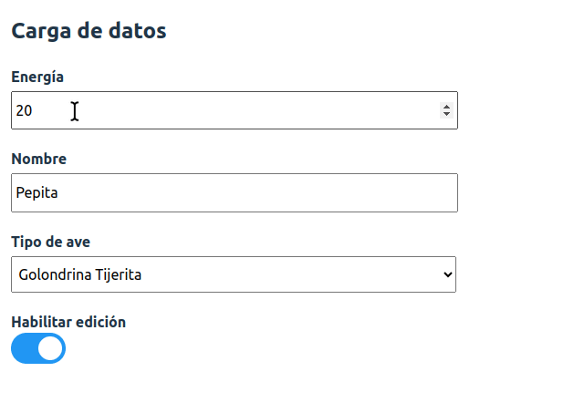

[](https://github.com/uqbar-project/eg-input-disabled-react/actions/workflows/build.yml) [](https://codecov.io/gh/uqbar-project/eg-input-disabled-react)

## Ejemplo input disabled o cómo anidar componentes

En este ejemplo queremos mostrar cómo diseñar un componente React que pueda trabajar con componentes hijos dinámicos.



## Definición del CustomInput

Entonces modelamos un `CustomInput` que acepta como props

- la propiedad `enabled` que nos dice si el control está habilitado para edición
- un valor a visualizar en el caso de estar deshabilitado

La función hace un renderizado condicional del elemento. El único detalle es que nos gustaría que sirviera para

- texto
- números
- dropdowns (combos)
- y en general para cualquier tipo de input

Para eso podemos aprovechar la props `children`, donde React inyecta automáticamente los hijos del componente actual. `children` referencia a una expresión JSX/TSX, por lo tanto, el `CustomInput` puede recibir y devolver esa prop como parte de su definición:

```ts
export const CustomInput = ({ enabled, children, value }: CustomInputPayload) =>
  enabled ? children : <span className="disabled">{value ?? children?.props.value}</span>
```

Incluso

- podemos recibir el valor a mostrar en caso de estar deshabilitado (`value`)
- o bien el hijo puede recibir en sus `props` el valor (para el input text, el number y el dropdown esto es así)

## Uso del CustomInput

En nuestro componente principal, podemos ver cómo utilizamos CustomInput con el nombre del ave:

```tsx
<CustomInput enabled={enabled}>
  <input type="text" value={pepita.nombre} data-testid="input-nombre" onChange={(event) => actualizar('nombre', event.target.value)}></input>
</CustomInput>
```

o bien con el dropdown que elige el tipo de ave:

```tsx
<CustomInput enabled={enabled}>
  <select value={pepita.tipoDeAve} onChange={(event) => { actualizar('tipoDeAve', event.target.value) }}>
    <option value="">Seleccione un tipo de ave</option>
    { tiposDeAve.map((tipoDeAve) => <option value={tipoDeAve.nombre}>{tipoDeAve.nombre}</option>) }
  </select> 
</CustomInput>
```

Pasamos como `props.children` un `input`, un `select`, componentes que pueden ser HTML o React. El flag `enabled` forma parte del estado de nuestro componente App, y se asocia con el `checkbox` que está al final del formulario:

```tsx
const App = () => {
  
  const [enabled, setEnabled] = useState(true)

  return (
    ...
    <input data-testid="input-enabled" type="checkbox" checked={enabled} onChange={() => setEnabled(!enabled)}/>
```

## Actualización del objeto en el formulario

Un detalle adicional es que definimos una sola función para actualizar a pepita:

```ts
const actualizar = (referencia: keyof typeof pepita, valor: unknown) => {
  setPepita({
    ...pepita,
    [referencia]: valor
  })
}
```

En cada control solo necesitamos pasar:

- cuál es el atributo que queremos modificar, por eso el tipo es `keyof` del objeto pepita (esto permite que no podamos pasar un atributo que no exista en pepita)
- cuál es el valor nuevo: utilizamos el tipo `unknown` dado que podemos trabajar con numbers o strings, pero no nos interesa enviarle mensajes. Podríamos usar `any` pero eso deshabilita el chequeo de tipos que trae Typescript. Para más información podés ver [este artículo](https://dmitripavlutin.com/typescript-unknown-vs-any/).

El control que modifica la energia define el onChange de la siguiente manera:

```tsx
<input type="text" ... onChange={(event) => actualizar('nombre', event.target.value)}></input>
```

El que cambia el tipo de ave lo hace de manera similar:

```tsx
<select ... onChange={(event) => { actualizar('tipoDeAve', event.target.value) }}>
```

## Forzando el render de los cambios

Repasemos una vez más este código:

```ts
const actualizar = (referencia: keyof typeof pepita, valor: unknown) => {
  setPepita({
    ...pepita,
    [referencia]: valor
  })
}
```

Lo que nosotros hacemos es: 1) pisar el valor en la referencia, 2) actualizar el estado de pepita **haciendo una copia de ella (para que React detecte los cambios)**.

Si nosotros modificamos la definición de la función actualizar:

```ts
const actualizar = (referencia: keyof typeof pepita, valor: unknown) => {
  pepita[referencia] = valor
  setPepita(pepita)
}
```

ahora los cambios no son reactivos: React no es capaz de detectar que hubo un cambio en pepita, porque de hecho **sigue siendo la misma referencia** (solo cambiaron las referencias internas de pepita, no el objeto apuntado por la referencia `pepita`).

> Hay que ser cuidadosos con las reglas que React nos propone: no todo debe ser inmutable (pepita por ejemplo es un objeto que puede mutar sus referencias), **pero lo que forma parte del estado de un componente React sí debe ser inmutable**.

## Testeo

Proveemos tres funciones de testeo para CustomInput:

- el escenario inicial en el que un control está habilitado
- además si está habilitado podemos modificar el valor
- y el escenario en el que el control está deshabilitado
